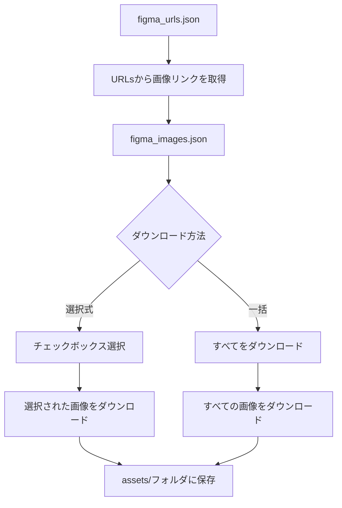

# 🎨 Figma Image Exporter TUI

FigmaのURLから画像を取得してassetsフォルダに保存するターミナルユーザーインターフェース（TUI）ツールです。


## ✨ 特徴

- 🖥️ **美しいTUI**: Rich Consoleによる美しいターミナルインターフェース
- ⌨️ **Vimライクキー操作**: jklhキーでの直感的なナビゲーション
- 🔗 **一括URL処理**: JSONファイルから複数のFigma URLを一括読み込み
- ☑️ **選択式ダウンロード**: チェックボックスで必要な画像のみを選択
- 📦 **一括ダウンロード**: すべての画像を一度にダウンロード
- ⚙️ **設定管理**: トークンやパス設定を永続化
- 📊 **プログレス表示**: リアルタイムの進捗バーとステータス表示
- 🔄 **エラーハンドリング**: 堅牢なエラー処理とフォールバック機能

## 📸 スクリーンショット

### メインメニュー
```
🎨 Figma Image Exporter TUI

► URLsから画像リンクを取得
  選択して画像をダウンロード
  すべてをダウンロード
  設定を変更
  終了

⚙️ Current Settings:
  URLs File: figma_urls.json
  Output File: figma_images.json
  Assets Directory: assets
  Figma Token: 設定済み

j/k: 上下移動, Space/Enter: 決定, q: 終了
```

### チェックボックス選択
```
画像を選択してください

► [✓] Sample Design 1
  [ ] Sample Design 2
  [✓] Design Component
  [ ] Icon Set

選択済み: 2/4

j/k: 上下移動, Space: 選択切替, a: 全選択/解除, Enter: 決定, q: キャンセル
```

## 🚀 インストール

### 必要環境
- Python 3.8以上
- pip
- インターネット接続（Figma API用）

### クイックインストール

```bash
# リポジトリをクローン
git clone https://github.com/your-username/figma-image-exporter-tui.git
cd figma-image-exporter-tui

# 依存関係をインストール
pip install -r requirements_tui.txt

# Figma Tokenを設定
export FIGMA_TOKEN=your_figma_token_here

# 実行
python figma_tui.py
```

### 統合TUIツール集から
```bash
# TUI Tools Collection経由でインストール
curl -fsSL https://provider.maekawa.dev/install.sh | bash -s figma-exporter
```

## ⚙️ 設定

### 1. Figma Tokenの取得
1. [Figma](https://www.figma.com/) にログイン
2. Settings → Account → Personal Access Tokens
3. 新しいトークンを生成
4. トークンをコピー

### 2. 設定方法

#### 環境変数（推奨）
```bash
export FIGMA_TOKEN=your_token_here
```

#### 設定ファイル
```json
// figma_config.json
{
    "figma_token": "your_token_here",
    "urls_file": "figma_urls.json",
    "output_file": "figma_images.json",
    "assets_dir": "assets"
}
```

#### コマンドライン引数
```bash
python figma_tui.py --token your_token_here --urls-file custom_urls.json
```

### 3. URLsファイルの設定
```json
// figma_urls.json
[
  {
    "name": "ホームページデザイン",
    "url": "https://www.figma.com/file/ABC123/Homepage?node-id=1%3A2&t=xyz123"
  },
  {
    "name": "アイコンセット",
    "url": "https://www.figma.com/file/DEF456/Icons?node-id=2%3A3&t=abc456"
  },
  {
    "name": "ボタンコンポーネント",
    "url": "https://www.figma.com/file/GHI789/Components?node-id=3%3A4&t=def789"
  }
]
```

## 🎮 使用方法

### 基本操作
1. **アプリケーションを起動**
   ```bash
   python figma_tui.py
   ```

2. **URLsから画像リンクを取得**
   - `1` を選択またはメニューで選択
   - 自動的にFigma APIから画像URLを取得

3. **画像をダウンロード**
   - **選択式**: `2` → チェックボックスで選択 → Enter
   - **一括**: `3` → 確認 → y

### キー操作

#### メニューナビゲーション
- `j` / `↓`: 下移動
- `k` / `↑`: 上移動
- `h` / `←`: 左移動（設定画面など）
- `l` / `→`: 右移動（設定画面など）
- `Space` / `Enter`: 決定
- `q`: 終了・キャンセル

#### チェックボックス選択
- `j/k`: 上下移動
- `Space`: 選択切り替え
- `a`: 全選択/全解除
- `Enter`: 決定
- `q`: キャンセル

#### 設定画面
- `j/k`: 項目移動
- `Space/Enter`: 編集・実行
- `q`: 戻る

### コマンドライン オプション

```bash
python figma_tui.py [オプション]

オプション:
  --urls-file FILE       URLsファイルのパス (デフォルト: figma_urls.json)
  --output-file FILE     出力ファイルのパス (デフォルト: figma_images.json)
  --assets-dir DIR       アセットディレクトリのパス (デフォルト: assets)
  --token TOKEN          Figma Token (環境変数 FIGMA_TOKEN または設定ファイルからも取得可能)
  -h, --help            ヘルプを表示
```

## 📊 ワークフロー



## 📁 ファイル構造

```
figma-image-exporter-tui/
├── figma_tui.py           # メインアプリケーション
├── requirements_tui.txt   # Python依存関係
├── README.md             # このファイル
├── figma_urls.json       # FigmaのURLs設定（作成される）
├── figma_config.json     # アプリケーション設定（作成される）
├── figma_images.json     # 取得した画像URLs（作成される）
└── assets/               # ダウンロードした画像（作成される）
    ├── Design_1.png
    ├── Icon_Set.png
    └── ...
```

## 🔧 高度な使用方法

### 複数プロジェクトの管理
```bash
# プロジェクト別のディレクトリで実行
mkdir project1 project2
cd project1
python ../figma_tui.py --urls-file project1_urls.json --assets-dir project1_assets
```

### バッチ処理
```bash
# 設定済みの場合、一括処理が可能
python figma_tui.py
# TUIで "3. すべてをダウンロード" を選択
```

### CI/CD統合
```yaml
# GitHub Actions例
- name: Download Figma Assets
  run: |
    export FIGMA_TOKEN=${{ secrets.FIGMA_TOKEN }}
    python figma_tui.py
    # 非インタラクティブモードでの実行も可能
```

## 🐛 トラブルシューティング

### よくある問題

#### 1. Figma Token関連
```
❌ FIGMA_TOKENが設定されていません
```
**解決方法**: 
- 環境変数を設定: `export FIGMA_TOKEN=your_token`
- 設定ファイルに記載
- TUIの設定画面で入力

#### 2. URL形式エラー
```
✗ Sample Design 1: 無効なFigma URL
```
**解決方法**: 
- FigmaのURLが正しい形式か確認
- `https://www.figma.com/file/[FILE_ID]/[NAME]?node-id=[NODE_ID]` 形式

#### 3. API制限
```
⚠ Sample Design 2: 画像URL取得失敗
```
**解決方法**: 
- Figma Tokenの権限を確認
- APIレート制限の可能性（時間をおいて再実行）

#### 4. ネットワークエラー
```
画像ダウンロードエラー: Connection timeout
```
**解決方法**: 
- インターネット接続を確認
- プロキシ設定がある場合は環境変数設定

### デバッグモード
```bash
# 詳細なログ出力
python figma_tui.py --verbose

# 設定確認
python figma_tui.py --check-config
```

## 🔒 セキュリティ

- **Tokenの保護**: 環境変数または設定ファイルで管理
- **ローカル保存**: すべてのデータはローカルに保存
- **HTTPS通信**: Figma APIとの通信は暗号化
- **権限最小化**: 必要最小限のFigma権限のみ使用

## 🤝 コントリビューション

1. このリポジトリをフォーク
2. フィーチャーブランチを作成 (`git checkout -b feature/amazing-feature`)
3. 変更をコミット (`git commit -m 'Add amazing feature'`)
4. ブランチにプッシュ (`git push origin feature/amazing-feature`)
5. プルリクエストを作成

### 開発環境のセットアップ
```bash
# 開発用依存関係をインストール
pip install -r requirements_dev.txt

# テスト実行
python -m pytest tests/

# コードフォーマット
black figma_tui.py
```

## 📄 ライセンス

このプロジェクトはMITライセンスの下で公開されています。詳細は [LICENSE](LICENSE) ファイルを参照してください。

## 🙏 謝辞

- [Rich](https://github.com/Textualize/rich) - 美しいターミナル出力
- [Requests](https://github.com/psf/requests) - HTTP通信
- [Figma API](https://www.figma.com/developers/api) - Figmaとの連携

## 📞 サポート

- 🐛 **バグ報告**: [Issues](https://github.com/your-username/figma-image-exporter-tui/issues)
- 💡 **機能要望**: [Feature Requests](https://github.com/your-username/figma-image-exporter-tui/issues/new?template=feature_request.md)
- 📧 **連絡**: your-email@example.com

## 🔗 関連プロジェクト

- [Discord Exporter TUI](https://github.com/your-username/discord-exporter-tui) - Discord用TUIツール
- [TUI Tools Collection](https://github.com/your-username/tui-tools) - 統合TUIツール集

---

<div align="center">
  <p>⭐ このプロジェクトが役に立った場合は、スターをつけていただけると嬉しいです！</p>
  <p>Made with ❤️ by terminal enthusiasts</p>
</div>